# CircuitPython-Bundle-Manager
A Python program that makes it easy to manage modules on a CircuitPython device! Problems? Please 
[file an issue](https://github.com/UnsignedArduino/CircuitPython-Bundle-Manager/issues/new) or even better, a pull 
request if you can fix it! 

Note: If you are viewing this file offline, the HTML generated from this markdown isn't perfect. It is highly 
recommended that you view this file on 
[GitHub](https://github.com/UnsignedArduino/CircuitPython-Bundle-Manager/blob/main/README.md), as it has been tuned for 
GitHub-style markdown.

## Table of Contents
1. [Installing](#installing)
   1. [Installing from a binary](#installing-from-a-binary)
   2. [Installing from source](#installing-from-source)
2. [Running](#running)
3. [How to use](#how-to-use)
   1. [First use](#first-run)
   2. [Selecting a device](#selecting-a-device)
   3. [Managing modules](#managing-modules)
   4. [Keeping the bundle updated](#keeping-the-bundle-updated)
   5. [Automatically detecting imported modules](#automatically-detecting-imported-modules)
   6. [Other](#other)
4. [Options](#options)

## Installing

~~Sooner or later, I will get binaries for Windows and Linux. (Sorry macOS users - I don't have a macOS computer!) For 
now, you are going to have to install everything manually.~~ Binaries are now available for Windows and Linux! Check it 
out [here](https://github.com/UnsignedArduino/CircuitPython-Bundle-Manager/releases).

### Installing from a binary

No installation is required! (Well, there is no installer. You are still going to have to create a shortcut/symlink to 
it somewhere and extract it if you are using the directory-based executable)

These binaries were built with [PyInstaller](https://www.pyinstaller.org/).

#### Using the one executable:

1. Download the latest binary from [here](https://github.com/UnsignedArduino/CircuitPython-Bundle-Manager/releases).
2. Put it somewhere. On Windows, I would put it in `C:\Program Files\CircuitPython Bundle Manager`. On Linux, I would 
   put it in `/usr/bin`.
3. Create a shortcut/symlink to it on the desktop!

Note: If you are having trouble with the one-executable, try the one directory method!
##### Pros of the one-executable
* Convenient - you only need to deal with one executable.
* Easy to install - just place the executable somewhere and create a shortcut.
##### Cons of the one-executable
* Takes quite a while to start compared to the one-directory method.
* Needs to execute code out of the temporary directory, which sometimes isn't allowed on Linux.
* If the application crashes, the support code won't be deleted, so it will take up disk space until the OS clears it.
* Needs more space than the one-directory method.

#### Using the one directory:
1. Download the zip/tar.gz file from [here](https://github.com/UnsignedArduino/CircuitPython-Bundle-Manager/releases).
2. Extract it. 
3. Place the directory somewhere convenient. On Windows, I would put the extracted files and directories in 
   `C:\Program Files\CircuitPython Bundle Manager`.
4. Create a shortcut/symlink to `CircuitPython Bundle Manager.exe`. (`CircuitPython Bundle Manager` on Linux) It is in 
   the top directory.

##### Pros of the one directory:
* Fast - all the support files are ready, no need to extract them like in the one-executable method.
* Less space - needs less disk space then the one-executable method.
##### Cons of the one directory:
* Slightly annoying to install. 

You can find a detailed description of the one-directory method 
[here](https://pyinstaller.readthedocs.io/en/stable/operating-mode.html#bundling-to-one-folder) and a description of 
how the one-file method works 
[here](https://pyinstaller.readthedocs.io/en/stable/operating-mode.html#bundling-to-one-file).

[Back to table of contents](#table-of-contents)

### Installing from source

1. [Download](https://git-scm.com/downloads) and install Git. It does not matter what editor you use for Git's default.
    1. Or...download this repo via the `Download ZIP` option under the green `Code` button, shown in Figure 1.1:
    
    
    
2. [Download](https://www.python.org/downloads/) and install Python **3.9**. (Because I use type definitions)
    1. Make sure to check `Add Python 3.x to PATH`, as shown in Figure 1.2:
       
       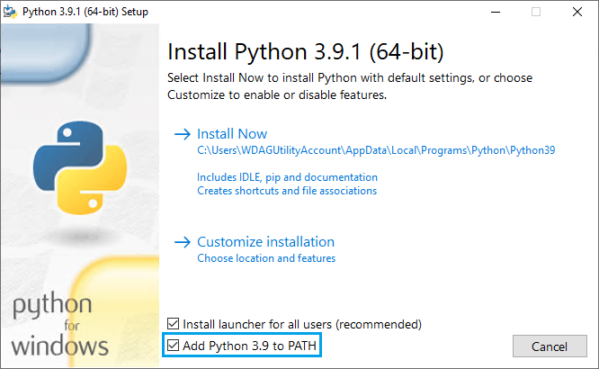
       
    2. Make sure to also install Tk/Tcl support! If you can access the IDLE, then Tk/Tcl is installed, as shown in 
       Figure 1.3: (Only applies if you are using the `Customize installation` option in the installer)
       
       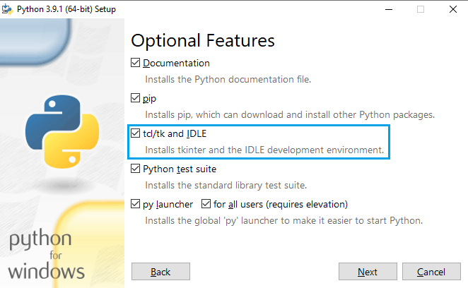
   
       If you are building Python,
       [Here is a guide on building Python on Debian I found helpful.](https://linuxize.com/post/how-to-install-python-3-8-on-debian-10/)

3. If you are on Windows, I would also install the 
   [Windows Terminal](https://www.microsoft.com/en-us/p/windows-terminal/9n0dx20hk701) while you are at it.

4. If you installed Git, `cd` into a convenient directory (like the home directory or the desktop) and run:
    ```commandline
    git clone https://github.com/UnsignedArduino/CircuitPython-Bundle-Manager
    cd CircuitPython-Bundle-Manager
    ```
    1. If you downloaded the ZIP, move the downloaded ZIP to somewhere convenient (ex. home directory or desktop), 
       extract it, open a terminal and `cd` into the extracted directory.

5. If you run `dir` (or `ls` on Mac and Linux) you should get something like this:

    1. `dir` (Windows):
    
    ```commandline
    01/18/2021  08:11 PM    <DIR>          .
    01/18/2021  08:11 PM    <DIR>          ..
    01/18/2021  08:11 PM    <DIR>          bundle_tools
    01/18/2021  08:11 PM            39,625 gui.py
    01/18/2021  08:11 PM    <DIR>          gui_tools
    01/18/2021  08:11 PM               329 main.py
    01/18/2021  08:11 PM             1,949 README.md
    01/18/2021  08:11 PM                18 requirements.txt
                   4 File(s)         41,921 bytes
                   4 Dir(s)  x bytes free
    ```

   2. `ls` (macOS and Linux):
    
    ```commandline
    bundle_tools  gui.py  gui_tools  main.py  README.md  requirements.txt
    ```

6. If you are going to use a [virtual environment](https://docs.python.org/3/library/venv.html), run the following 
   commands:
    1. Windows:
    ```commandline
    python -m venv .venv
    ".venv/Scripts/activate.bat"
    ```
    2. macOS and Linux:
    ```commandline
    python3 -m venv
    source .venv/bin/activate
    ```

7. Install the packages:
    1. Windows:
    ```commandline
    pip install -r requirements.txt
    ```
    2. macOS and Linux:
    ```commandline
    pip3 install -r requirements.txt
    ```

8. You should now be able to run it!
    1. Windows:
    ```commandline
    python main.py
    ```
    2. macOS and Linux:
    ```commandline
    python3 main.py
    ```

[Back to table of contents](#table-of-contents)

## Running
**This only applies if you installed from source!**
If you are not using a virtual environment, then you can just create a `.bat` file containing 
`python \path\to\the\main.py` (`python3`, forward slashes, and use `.sh` for the extension on macOS and Linux) on the 
desktop for convenience. Otherwise, you will need to re-activate the virtual environment everytime you want to run it. 
I highly recommend using these shell scripts:

1. Windows:

```batch
:: Replace this with the path to the directory of the CircuitPython Bundle Manager, should have main.py in it
cd path\to\the\CircuitPython-Bundle-Manager
:: You can use python.exe or pythonw.exe - the w one will just supress output of the program
".venv\Scripts\pythonw.exe" main.py
```

2. macOS and Linux:

```shell
# Replace with the path to the CircuitPython Bundle Manager
cd path/to/the/CircuitPython-Bundle-Manager
.venv/bin/python3 main.py
```
Don't forget to give the `.sh` file execute permission! (`chmod +x shell_file.sh`)

[Back to table of contents](#table-of-contents)
## How to use

### First run
On run, you should get something like this:

> If the GUI looks different from these images, it's because I don't want to update all these images. I will only 
> update the relevant images. (So if I add something in the example, Bundle Manager, then I will include new 
> instructions on how to use it, I won't be updating all the images that show the Bundle Manager.) The functionality 
> _should_ still be the same.

Figure 2.1: Start up on Windows.


Figure 2.2: Start up on Debian. (To be honest, Tk doesn't look that _great_ on Linux...)

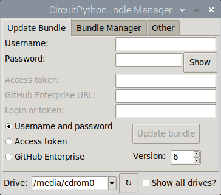

> Note: From now on, I will be exclusively showing pictures of the CircuitPython Bundle Manager on Windows unless there 
> are Linux-specific instructions. The interface is _exactly_ the same.

What you want to do is to authenticate yourself and update the bundle so you can install modules. You can do it several 
ways:
1. Use your username and password
2. Use a GitHub token
3. Use a GitHub Enterprise URL and a login/token

Use the radio buttons (boxed in Figure 1.3) to select your method of authentication.

Figure 2.3: The radio buttons used to select the method of authentication. 

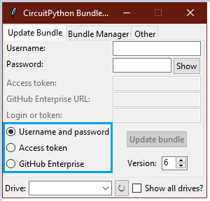

If you used your username and password, type in your username and password. (Labeled `1` in Figure 1.4)

If you used a GitHub access token, paste it in. (Labeled `2` in Figure 1.4)

If you used a GitHub Enterprise URL and a login/token, paste those in. (Labled `3` in Figure 1.4)

Figure 2.4: The methods of authentication labeled. Since I selected `Username and password` in the authentication 
method selector, I can only type in the `Username` and `Password` boxes.


Once you fill those in, make sure the version listbox (boxed in figure 2.5) has the correct version of CircuitPython 
you plan to use. If it does not exist or is too old, you will get an error shown in figure 2.6. If you input some bad 
credentials, you will get an error shown in figure 2.7. 

Figure 2.5: The version listbox boxed. 

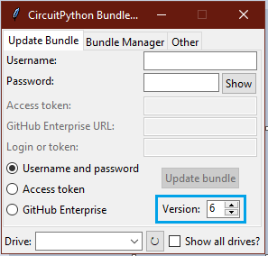

Figure 2.6: The error you get when inputting a bad version. Sadly, CircuitPython 7 doesn't exist. (yet)


Figure 2.7: The error you get when inputting bad credentials.


Press `Update bundle`, and if all goes well, you should get a happy info message shown in Figure 1.8:

> Note: You will need a working internet connection for this!

Figure 2.8: The info box when the bundle updates successfully.

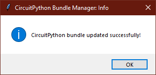

That is it! Continue to 
[selecting a device](#selecting-a-device).

[Back to table of contents](#table-of-contents)

### Selecting a device

At the bottom of the UI, there is a section which will be shown regardless of the tab selected. This is where you can 
select your CircuitPython device, as shown in Figure 2.9:

Figure 2.9: The drive selector highlighted.

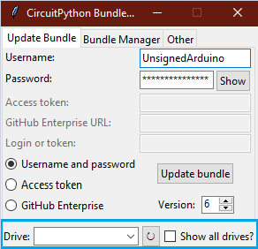

If you click on the downwards facing arrow in the entry box (labeled `1` in Figure 2.10) a small menu will pop up. It 
will most likely be empty unless you have a CircuitPython device connected, or you have `Show all drives?` checked. 
(Labeled `3` in Figure 2.10, and shown in Figure 2.11) The reload button (labeled `2` in Figure 2.10 reloads a handful 
of things, including what drives are connected, so if you don't see your drive, click it!)

Figure 2.10: Various parts of the drive selector labeled.

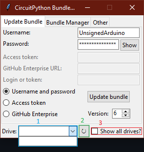

Figure 2.11: More drives are shown with the `Show all drives?` checkbox checked. You will most likely not need this 
checked.

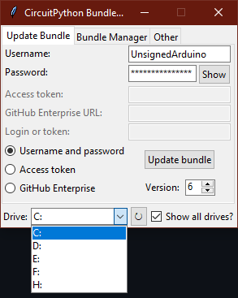

On Linux (and macOS too - I think) it will look slightly different. Instead of drive letters, a path will be shown, 
like in Figure 2.12:

Figure 2.12: The drive selector on Linux.

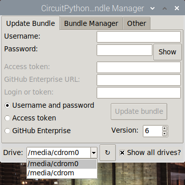

The CircuitPython Bundle Manager searches for drives in `/media`. If your OS does not mount drives there, follow these 
instructions:
1. Connect a CircuitPython device.
2. Mount the device if necessary.
3. Get the path of where the device was mounted. For example, `/media/pi/CIRCUITPY`.
4. Switch to the `Other` tab and click on `Open config file`.
5. Change the value of `unix_drive_mount_point` to the parent directory of the path of the device.
   
   Figure 2.13: My configuration file after modifying it:
   
   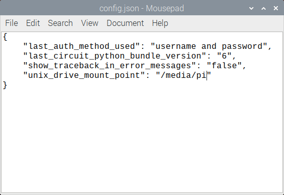
6. Click the refresh button
7. Select the device!

That is it! Continue to 
[managing modules](#managing-modules).

[Back to table of contents](#table-of-contents)

### Managing modules

This is the fun part! (Well, not really) Here you can view the modules you can install and the modules already 
installed on the selected CircutiPython device! Figure 2.14 shows an anatomy of the `Bundle Manager` tab:

Figure 2.14: An anatomy of the`Bundle Manager` tab.

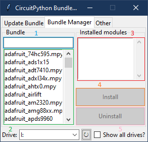

1. (Blue) This is the search bar - typing in it will filter out modules that don't have that string inside it. 
   (Uses Python's `in` keyword)
2. (Green) This is where you where can scroll through the list of modules you can install - will reflect the contents 
   of the most recent bundle **on your machine**. If it's blank, try pressing the reload button and updating the bundle!
3. (Red) This is the list of installed modules on the selected CircutiPython device - after selecting a new one, press 
   refresh!
4. (Orange) If a module is selected in the bundle and there is a selected device, then you can install to it!
5. (Pink)  If a module is selected in the list of installed modules and there is a selected device, you can uninstall 
   it!

Let's say I wanted to install the `simpleio.mpy` module . First, I could either scroll through the list to find 
`simpleio` or use the search bar to search up `simpleio`, like in Figure 2.15:

Figure 2.15: Using the search bar to find the `simpleio.mpy` files. 


If it succeeds, you get an information box like in Figure 2.16:

Figure 2.16: Success!

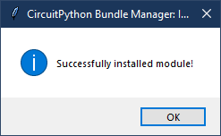

And in Figure 2.17, you can see it successfully installed!

Figure 2.17: Look, it's in the list of installed modules now!

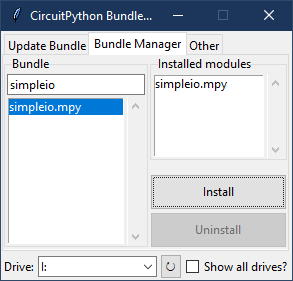

Oh never mind, we didn't need the `simpleio` module. To uninstall it, click on `simpleio.mpy` in the list of installed 
modules and press `Uninstall`!

Figure 2.18: Uninstalling the `simpleio.mpy` file.

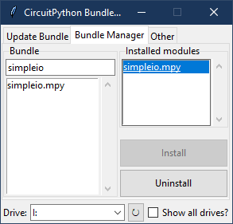

Figure 2.19: We see that it has been successfully uninstalled!

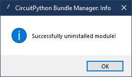

That is it! Continue to 
[keeping the bundle updated](#keeping-the-bundle-updated).

[Back to table of contents](#table-of-contents)

### Keeping the bundle updated

Follow the instructions provided in 
[first run](#first-run). You only need to do this once a 
day, since the bundle is updated once a day at ~12PM EST.

TL;DR:

1. Make sure you have a working internet connection.
2. Select method of authentication.
3. Input credentials.
4. Select CircuitPython version.
5. Press `Update`!

[Back to table of contents](#table-of-contents)

### Automatically detecting imported modules

> Note: This feature is still very new! Problems? 
> [Report an issue!](https://github.com/UnsignedArduino/CircuitPython-Bundle-Manager/issues/new)

Instead of scrolling through the bundle or using the search bar, why not save a couple more steps and have the 
CircuitPython Bundle Manager automatically detect dependencies for you? Figure 2.20 shows the `Detect` tab:

Figure 2.20: The `Detect` tab in the CircuitPython Bundle Manager.

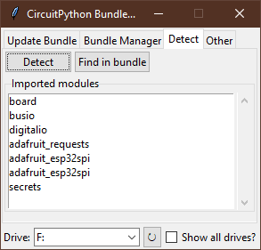

If you have a CircuitPython device selected and there is a valid code file (One of `code.txt`, `code.py`, `main.txt`, 
`main.py`) you can press the `Detect` button to have the CircuitPython Bundle Manager parse the code files and look at 
your import statements. I'm using [this example](https://learn.adafruit.com/adafruit-airlift-featherwing-esp32-wifi-co-processor-featherwing/internet-connect#connect-to-wifi-3035277-4:~:text=%23%20SPDX%2DFileCopyrightText%3A%202019%20ladyada%20for%20Adafruit,print(%22Done!%22)) 
from the Adafruit Airlift Featherwing Internet Connect guide from the Adafruit Learn site. If you click on one of the
modules and it's in the bundle, the `Find in bundle` button will light up. Pressing it will teleport you to the Bundle
Manager allowing you to click `Install`!

Figure 2.21: After clicking on `adafruit_requests` in the listbox and pressing `Find in bundle`, I was teleported here! 

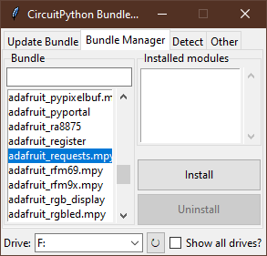

[Back to table of contents](#table-of-contents)

### Other

Figure 2.22: The `Other` tab in the CircuitPython Bundle Manager. The interface may change and I will probably forget 
to change this too.

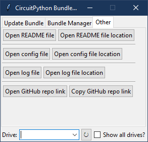

- `Open README file` opens this file locally with the default `.md` program. If it cannot find it, it will attempt to 
  download it from GitHub.
- `Open README file location` opens the location of the README file in the default file manager.
- `Open config file` opens the configuration file in the default `.json` program.
- `Open config file location` opens the location of the config file in the default file manager.
- `Open log file` opens the log file in the default `.log` program.
- `Open log file location` opens the location of the log file in the default file manager.
- `Open GitHub repo link` opens the repository in the default browser.
- `Copy GitHub repo link` copies the link to this repository on GitHub to the clipboard.

[Back to table of contents](#table-of-contents)

## Options
You can find these options in `config.json`, which is in the same directory as 
[`main.py`](https://github.com/UnsignedArduino/CircuitPython-Bundle-Manager/blob/main/main.py), and should be 
auto-generated upon first run. In case it does not happen, (file a issue?) this is the default JSON file:
```json
{
    "last_auth_method_used": "username and password",
    "last_circuit_python_bundle_version": "6",
    "show_traceback_in_error_messages": "false",
    "unix_drive_mount_point": "/media"
}
```
- `last_auth_method_used` should be a string of `username and password`, `access token`, or `enterprise`. This is the 
  last method of authentication you used.
- `last_circuitpython_bundle_version` should be a string of a number. This is the last CircuitPython version you used.
- `show_traceback_in_error_messages` should be a string of a bool. (Like `1`, `true`, `yes` for `True` and anything 
  else for `False`) This will control whether stack traces will appear in error messages.
- `unix_drive_mount_point` should be a string of a path that points to the place where your distro automatically mounts 
  drives. Only applies to Unix-based systems.

If you want to reset the config file, either delete it or clear the contents of the config. If you want to reset just 
one option, remove it from the configuration file.

[Back to table of contents](#table-of-contents)